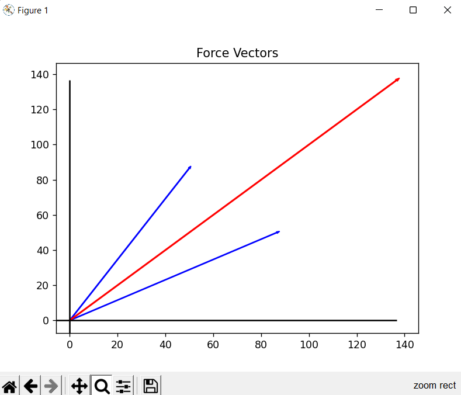
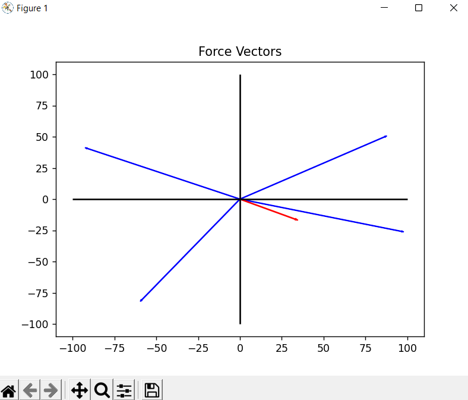
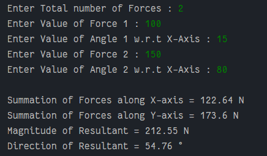

# Resultant force Calculator

### Functions

- Resolves Forces into Rectangular Components
- Calculates Summation of forces acting along the X-Axis i.e (Σfx)
- Calculates Summation of forces acting along the Y-Axis i.e (Σfy)
- Calculates the Resultant force acting on the Body using
> Resultant (R)² =  Σfx² + Σfy²
- Calculates the Angle made by resultant w.r.t X-Axis
> Theta θ = atan(Σfy/Σfx)

### Visualisation

- Represents all Forces and Resultant in their Vector form.
- All Vectors starts at origin (0, 0)
- Resultant vector is represented by RED
- Force vectors are represented by BLUE

##### Examples :

##### Example Output

- Outputs are rounded off to 2 decimal places.

### Assumptions

- Resolution of a Force into Rectangular Components is valid
- All the forces are in same plane i.e Co-Planar Force system
- Angle assumed by user is with respect to the X - Axis

### Resources 

- [Resolution of a Force into Rectangular Components](http://ecoursesonline.iasri.res.in/mod/page/view.php?id=125329)
- [Python3 Math module](https://docs.python.org/3/library/math.html)
- [Python3 MatplotLib module](https://matplotlib.org/)